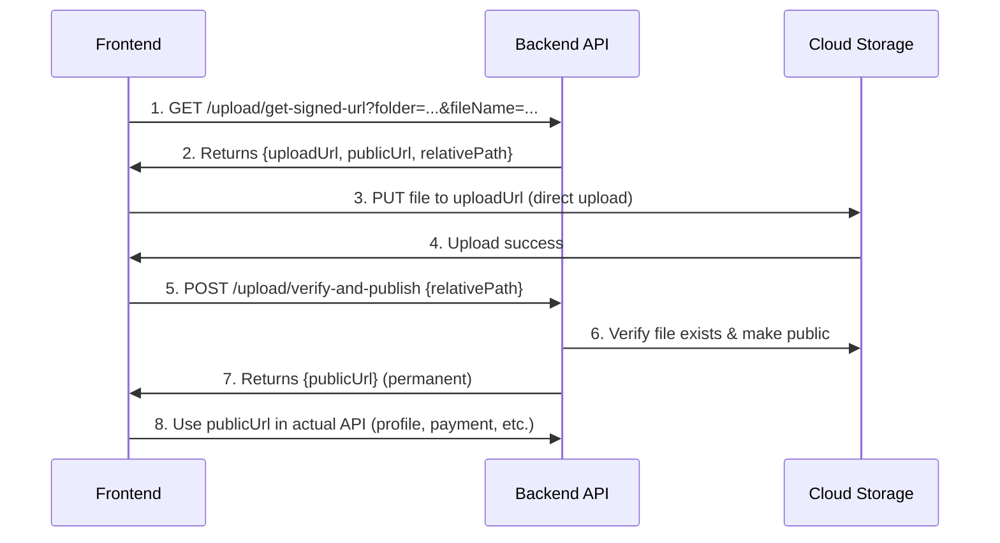

# Frontend Upload Integration Guide - Complete Documentation

## 🎯 Overview

This guide provides **complete step-by-step instructions** for frontend developers to integrate the new signed URL upload system. The backend NO LONGER accepts file uploads directly - all files must be uploaded to cloud storage first, then URLs are sent to the backend.

---

## 📋 Table of Contents

1. [Architecture Overview](#architecture-overview)
2. [Complete Upload Flow](#complete-upload-flow)
3. [API Endpoints Reference](#api-endpoints-reference)
4. [Step-by-Step Implementation](#step-by-step-implementation)
5. [React/JavaScript Examples](#reactjavascript-examples)
6. [Error Handling](#error-handling)
7. [Testing Guide](#testing-guide)
8. [Common Issues & Solutions](#common-issues--solutions)

---

## 🏗️ Architecture Overview

### Old System (DEPRECATED - Removed)
```
❌ Frontend → Upload file → Backend → Cloud Storage
```

### New System (Current)
```
✅ Frontend → Get signed URL → Upload to Cloud → Verify → Backend receives URL
```

### Why This Change?
- **Zero backend bandwidth** for file uploads
- **Faster uploads** - direct to cloud storage
- **Better security** - short-lived signed URLs
- **Scalability** - no backend bottleneck
- **Cost optimization** - reduced server load

---

## 🔄 Complete Upload Flow



---

## 🔌 API Endpoints Reference

### 1. Get Signed Upload URL

**Endpoint:** `GET /upload/get-signed-url`

**Authentication:** Required (Bearer token)

**Query Parameters:**
```typescript
{
  folder: string;        // Required: Use FIXED folder name for your feature (see table below)
  fileName: string;      // Required: Original filename
  contentType: string;   // Required: MIME type (e.g., 'image/jpeg')
  fileSize: number;      // Required: File size in bytes
  // expiresIn: FIXED at 600 seconds (10 minutes) - NOT configurable
}
```

**⚠️ IMPORTANT: Folder Names are FIXED for Each Feature**

**DO NOT let users choose folder names!** Each feature has a **predetermined folder**:

| Feature | Fixed Folder | Max Size | Allowed Types |
|---------|-------------|----------|---------------|
| User Profile | `profile-images` | 5MB | JPEG, PNG, WebP |
| Student Photos | `student-images` | 5MB | JPEG, PNG, WebP |
| Institute Logos/Images | `institute-images` | 10MB | JPEG, PNG, WebP, SVG |
| Institute User Images | `institute-user-images` | 5MB | JPEG, PNG, WebP |
| Subject Thumbnails | `subject-images` | 5MB | JPEG, PNG, WebP |
| Homework Submissions | `homework-files` | 20MB | PDF, JPEG, PNG, DOC, DOCX |
| Teacher Corrections | `correction-files` | 20MB | PDF, JPEG, PNG |
| Payment Receipts | `payment-receipts` | 10MB | JPEG, PNG, PDF |
| ID Card Documents | `id-documents` | 10MB | JPEG, PNG, PDF |

**Example: Hard-code the folder in your component**
```javascript
// ✅ CORRECT - Fixed folder for profile images
const folder = 'profile-images';  // Hard-coded, never changes
uploadFile(file, folder);

// ❌ WRONG - Don't let user select folder
const folder = document.getElementById('folderSelect').value; // DON'T DO THIS!
```

**Response:**
```json
{
  "success": true,
  "message": "Signed URL generated successfully (10 min expiry)",
  "uploadUrl": "https://storage.googleapis.com/suraksha-lms/profile-images/...",
  "publicUrl": "https://storage.googleapis.com/suraksha-lms/profile-images/avatar-uuid.jpg",
  "relativePath": "profile-images/avatar-uuid.jpg",
  "expiresAt": "2025-11-08T12:10:00.000Z",
  "instructions": {
    "step1": "Upload file using: PUT {uploadUrl}",
    "step2": "Add header: Content-Type: image/jpeg",
    "step3": "Call POST /upload/verify-and-publish with relativePath",
    "step4": "Use publicUrl in your application",
    "important": "File will be PRIVATE until you call /verify-and-publish"
  }
}
```

### 2. Verify and Publish File

**Endpoint:** `POST /upload/verify-and-publish`

**Authentication:** Required (Bearer token)

**Request Body:**
```json
{
  "relativePath": "profile-images/avatar-uuid.jpg"
}
```

**Response:**
```json
{
  "success": true,
  "message": "File verified and made public successfully",
  "publicUrl": "https://storage.googleapis.com/suraksha-lms/profile-images/avatar-uuid.jpg",
  "relativePath": "profile-images/avatar-uuid.jpg",
  "instructions": {
    "nextStep": "Use publicUrl in your API calls",
    "note": "This URL is now publicly accessible and has no expiration"
  }
}
```

---

## 🚀 Step-by-Step Implementation

### Step 1: File Selection

```javascript
// HTML
<input 
  type="file" 
  id="fileInput" 
  accept="image/jpeg,image/png,image/webp"
  onChange={handleFileSelect}
/>

// JavaScript
function handleFileSelect(event) {
  const file = event.target.files[0];
  
  // Validate file
  if (!file) {
    alert('Please select a file');
    return;
  }
  
  // Validate file size (5MB for profile images)
  const maxSize = 5 * 1024 * 1024; // 5MB
  if (file.size > maxSize) {
    alert('File size must not exceed 5MB');
    return;
  }
  
  // Validate file type
  const allowedTypes = ['image/jpeg', 'image/png', 'image/webp'];
  if (!allowedTypes.includes(file.type)) {
    alert('Only JPEG, PNG, and WebP images are allowed');
    return;
  }
  
  // Proceed to upload
  uploadFile(file);
}
```

### Step 2: Get Signed URL

```javascript
async function getSignedUrl(file, folder) {
  const token = localStorage.getItem('accessToken'); // Your JWT token
  
  // ⚠️ IMPORTANT: 'folder' should be HARD-CODED in your component
  // DON'T pass it as a user input! Use fixed values like:
  // - 'profile-images' for user profiles
  // - 'payment-receipts' for payment uploads
  // - 'homework-files' for homework submissions
  
  const params = new URLSearchParams({
    folder: folder,                    // FIXED value (e.g., 'profile-images')
    fileName: file.name,               // e.g., 'avatar.jpg'
    contentType: file.type,            // e.g., 'image/jpeg'
    fileSize: file.size.toString()     // e.g., '2048576'
    // expiresIn is FIXED at 10 minutes - do not send this parameter
  });
  
  const response = await fetch(
    `https://your-api.com/upload/get-signed-url?${params}`,
    {
      method: 'GET',
      headers: {
        'Authorization': `Bearer ${token}`,
        'Content-Type': 'application/json'
      }
    }
  );
  
  if (!response.ok) {
    const error = await response.json();
    throw new Error(error.message || 'Failed to get signed URL');
  }
  
  return await response.json();
}
```

### Step 3: Upload File to Cloud Storage

```javascript
async function uploadToCloud(file, uploadUrl, contentType) {
  // IMPORTANT: Use PUT method, not POST
  // IMPORTANT: Set Content-Type header to match file type
  const response = await fetch(uploadUrl, {
    method: 'PUT',
    headers: {
      'Content-Type': contentType,
      // DO NOT include Authorization header here
      // DO NOT include any other custom headers
    },
    body: file // Send raw file, not FormData
  });
  
  if (!response.ok) {
    throw new Error(`Upload failed with status ${response.status}`);
  }
  
  return true;
}
```

### Step 4: Verify and Publish

```javascript
async function verifyAndPublish(relativePath) {
  const token = localStorage.getItem('accessToken');
  
  const response = await fetch(
    'https://your-api.com/upload/verify-and-publish',
    {
      method: 'POST',
      headers: {
        'Authorization': `Bearer ${token}`,
        'Content-Type': 'application/json'
      },
      body: JSON.stringify({
        relativePath: relativePath
      })
    }
  );
  
  if (!response.ok) {
    const error = await response.json();
    throw new Error(error.message || 'Failed to verify upload');
  }
  
  return await response.json();
}
```

### Step 5: Use Public URL in Your API

```javascript
async function updateProfile(publicUrl) {
  const token = localStorage.getItem('accessToken');
  
  // Example: Update user profile with image URL
  const response = await fetch(
    'https://your-api.com/users/profile',
    {
      method: 'PATCH',
      headers: {
        'Authorization': `Bearer ${token}`,
        'Content-Type': 'application/json'
      },
      body: JSON.stringify({
        profileImageUrl: publicUrl // Send URL, not file
      })
    }
  );
  
  return await response.json();
}
```

---

## ⚛️ React/JavaScript Examples

### Complete React Component (Functional)

```typescript
import React, { useState } from 'react';

interface UploadProgress {
  stage: 'idle' | 'getting-url' | 'uploading' | 'verifying' | 'complete' | 'error';
  message: string;
  progress: number;
}

// ⚠️ IMPORTANT: This component is for PROFILE IMAGES ONLY
// The folder 'profile-images' is HARD-CODED and never changes
// Create separate components for other features with their own fixed folders:
// - PaymentReceiptUpload → folder: 'payment-receipts'
// - HomeworkUpload → folder: 'homework-files'
// - InstituteLogoUpload → folder: 'institute-images'

const FileUploadComponent: React.FC = () => {
  const [file, setFile] = useState<File | null>(null);
  const [progress, setProgress] = useState<UploadProgress>({
    stage: 'idle',
    message: '',
    progress: 0
  });
  const [publicUrl, setPublicUrl] = useState<string>('');

  // FIXED folder for this component - NEVER let user change this
  const UPLOAD_FOLDER = 'profile-images';  // Hard-coded constant

  const handleFileChange = (event: React.ChangeEvent<HTMLInputElement>) => {
    const selectedFile = event.target.files?.[0];
    if (!selectedFile) return;

    // Validate file size (5MB for profile images)
    const maxSize = 5 * 1024 * 1024;
    if (selectedFile.size > maxSize) {
      alert('File size must not exceed 5MB');
      return;
    }

    // Validate file type
    const allowedTypes = ['image/jpeg', 'image/png', 'image/webp'];
    if (!allowedTypes.includes(selectedFile.type)) {
      alert('Only JPEG, PNG, and WebP images are allowed');
      return;
    }

    setFile(selectedFile);
    setProgress({ stage: 'idle', message: 'File selected', progress: 0 });
  };

  const uploadFile = async () => {
    if (!file) {
      alert('Please select a file first');
      return;
    }

    try {
      // Step 1: Get signed URL
      setProgress({
        stage: 'getting-url',
        message: 'Getting upload URL from server...',
        progress: 20
      });

      const token = localStorage.getItem('accessToken');
      const params = new URLSearchParams({
        folder: UPLOAD_FOLDER,  // ✅ Using constant - NEVER user input
        fileName: file.name,
        contentType: file.type,
        fileSize: file.size.toString()
        // Do NOT send expiresIn - it's fixed at 10 minutes by backend
      });

      const signedUrlResponse = await fetch(
        `${process.env.REACT_APP_API_URL}/upload/get-signed-url?${params}`,
        {
          headers: {
            'Authorization': `Bearer ${token}`
          }
        }
      );

      if (!signedUrlResponse.ok) {
        throw new Error('Failed to get signed URL');
      }

      const signedUrlData = await signedUrlResponse.json();
      const { uploadUrl, relativePath } = signedUrlData;

      // Step 2: Upload to cloud storage
      setProgress({
        stage: 'uploading',
        message: 'Uploading file to cloud storage...',
        progress: 40
      });

      const uploadResponse = await fetch(uploadUrl, {
        method: 'PUT',
        headers: {
          'Content-Type': file.type
        },
        body: file
      });

      if (!uploadResponse.ok) {
        throw new Error(`Upload failed with status ${uploadResponse.status}`);
      }

      // Step 3: Verify and publish
      setProgress({
        stage: 'verifying',
        message: 'Verifying upload...',
        progress: 70
      });

      const verifyResponse = await fetch(
        `${process.env.REACT_APP_API_URL}/upload/verify-and-publish`,
        {
          method: 'POST',
          headers: {
            'Authorization': `Bearer ${token}`,
            'Content-Type': 'application/json'
          },
          body: JSON.stringify({ relativePath })
        }
      );

      if (!verifyResponse.ok) {
        throw new Error('Failed to verify upload');
      }

      const verifyData = await verifyResponse.json();
      setPublicUrl(verifyData.publicUrl);

      // Step 4: Use the URL in your API
      setProgress({
        stage: 'complete',
        message: 'Upload successful!',
        progress: 100
      });

      // Now you can use verifyData.publicUrl in your API calls
      await updateUserProfile(verifyData.publicUrl);

    } catch (error) {
      console.error('Upload error:', error);
      setProgress({
        stage: 'error',
        message: error instanceof Error ? error.message : 'Upload failed',
        progress: 0
      });
    }
  };

  const updateUserProfile = async (imageUrl: string) => {
    const token = localStorage.getItem('accessToken');
    
    const response = await fetch(
      `${process.env.REACT_APP_API_URL}/users/profile`,
      {
        method: 'PATCH',
        headers: {
          'Authorization': `Bearer ${token}`,
          'Content-Type': 'application/json'
        },
        body: JSON.stringify({
          profileImageUrl: imageUrl
        })
      }
    );

    if (!response.ok) {
      throw new Error('Failed to update profile');
    }

    return await response.json();
  };

  return (
    <div className="upload-container">
      <h2>Upload Profile Image</h2>
      
      <input
        type="file"
        accept="image/jpeg,image/png,image/webp"
        onChange={handleFileChange}
        disabled={progress.stage !== 'idle' && progress.stage !== 'complete' && progress.stage !== 'error'}
      />
      
      {file && (
        <div className="file-info">
          <p>Selected: {file.name}</p>
          <p>Size: {(file.size / 1024 / 1024).toFixed(2)} MB</p>
          <p>Type: {file.type}</p>
        </div>
      )}
      
      <button
        onClick={uploadFile}
        disabled={!file || (progress.stage !== 'idle' && progress.stage !== 'complete' && progress.stage !== 'error')}
      >
        {progress.stage === 'idle' || progress.stage === 'complete' || progress.stage === 'error'
          ? 'Upload'
          : 'Uploading...'}
      </button>
      
      {progress.message && (
        <div className={`progress-message ${progress.stage}`}>
          <p>{progress.message}</p>
          <div className="progress-bar">
            <div
              className="progress-fill"
              style={{ width: `${progress.progress}%` }}
            />
          </div>
        </div>
      )}
      
      {publicUrl && (
        <div className="success-message">
          <p>✅ Upload successful!</p>
          
          <p className="url-display">{publicUrl}</p>
        </div>
      )}
    </div>
  );
};

export default FileUploadComponent;
```

### Vanilla JavaScript (No Framework)

```javascript
// Complete vanilla JS implementation
class FileUploader {
  constructor(apiUrl, token) {
    this.apiUrl = apiUrl;
    this.token = token;
  }

  // ⚠️ IMPORTANT: 'folder' parameter should be HARD-CODED when calling this method
  // Don't let users choose the folder - each feature has a fixed folder
  async uploadFile(file, folder = 'profile-images') {
    try {
      // Step 1: Get signed URL
      console.log('Step 1: Getting signed URL...');
      const signedUrlData = await this.getSignedUrl(file, folder);
      console.log('✓ Signed URL received');

      // Step 2: Upload to cloud
      console.log('Step 2: Uploading to cloud storage...');
      await this.uploadToCloud(file, signedUrlData.uploadUrl, file.type);
      console.log('✓ File uploaded to cloud');

      // Step 3: Verify and publish
      console.log('Step 3: Verifying and publishing...');
      const publishData = await this.verifyAndPublish(signedUrlData.relativePath);
      console.log('✓ File verified and published');

      return publishData.publicUrl;
    } catch (error) {
      console.error('Upload failed:', error);
      throw error;
    }
  }

  async getSignedUrl(file, folder) {
    const params = new URLSearchParams({
      folder: folder,
      fileName: file.name,
      contentType: file.type,
      fileSize: file.size.toString()
      // expiresIn is fixed at 600 seconds (10 minutes) - do not include
    });

    const response = await fetch(
      `${this.apiUrl}/upload/get-signed-url?${params}`,
      {
        headers: {
          'Authorization': `Bearer ${this.token}`
        }
      }
    );

    if (!response.ok) {
      const error = await response.json();
      throw new Error(error.message || 'Failed to get signed URL');
    }

    return await response.json();
  }

  async uploadToCloud(file, uploadUrl, contentType) {
    const response = await fetch(uploadUrl, {
      method: 'PUT',
      headers: {
        'Content-Type': contentType
      },
      body: file
    });

    if (!response.ok) {
      throw new Error(`Upload failed with status ${response.status}`);
    }

    return true;
  }

  async verifyAndPublish(relativePath) {
    const response = await fetch(
      `${this.apiUrl}/upload/verify-and-publish`,
      {
        method: 'POST',
        headers: {
          'Authorization': `Bearer ${this.token}`,
          'Content-Type': 'application/json'
        },
        body: JSON.stringify({ relativePath })
      }
    );

    if (!response.ok) {
      const error = await response.json();
      throw new Error(error.message || 'Failed to verify upload');
    }

    return await response.json();
  }
}

// Usage example
const uploader = new FileUploader(
  'https://your-api.com',
  'your-jwt-token'
);

document.getElementById('fileInput').addEventListener('change', async (e) => {
  const file = e.target.files[0];
  if (!file) return;

  try {
    const publicUrl = await uploader.uploadFile(file, 'profile-images');
    console.log('Public URL:', publicUrl);
    
    // Use the URL in your API
    await updateProfile(publicUrl);
  } catch (error) {
    alert('Upload failed: ' + error.message);
  }
});
```

### Axios Implementation

```javascript
import axios from 'axios';

const api = axios.create({
  baseURL: 'https://your-api.com',
  headers: {
    'Authorization': `Bearer ${localStorage.getItem('accessToken')}`
  }
});

async function uploadFileWithAxios(file, folder = 'profile-images') {
  try {
    // Step 1: Get signed URL
    const { data: signedUrlData } = await api.get('/upload/get-signed-url', {
      params: {
        folder,
        fileName: file.name,
        contentType: file.type,
        fileSize: file.size
      }
    });

    // Step 2: Upload to cloud (no axios for this - use fetch)
    const uploadResponse = await fetch(signedUrlData.uploadUrl, {
      method: 'PUT',
      headers: {
        'Content-Type': file.type
      },
      body: file
    });

    if (!uploadResponse.ok) {
      throw new Error('Upload to cloud failed');
    }

    // Step 3: Verify and publish
    const { data: publishData } = await api.post('/upload/verify-and-publish', {
      relativePath: signedUrlData.relativePath
    });

    return publishData.publicUrl;
  } catch (error) {
    console.error('Upload error:', error);
    throw error;
  }
}

// Usage
const fileInput = document.getElementById('fileInput');
fileInput.addEventListener('change', async (e) => {
  const file = e.target.files[0];
  try {
    const publicUrl = await uploadFileWithAxios(file, 'profile-images');
    console.log('Success! URL:', publicUrl);
  } catch (error) {
    alert('Upload failed: ' + error.message);
  }
});
```

---

## 🎯 Specific Use Cases

### 1. Profile Image Upload

```javascript
async function uploadProfileImage(file) {
  // ⚠️ FIXED FOLDER: 'profile-images' is hard-coded for profile uploads
  const PROFILE_FOLDER = 'profile-images';  // NEVER change this
  
  const uploader = new FileUploader(API_URL, token);
  const publicUrl = await uploader.uploadFile(file, PROFILE_FOLDER);
  
  // Update profile with URL
  await fetch(`${API_URL}/users/profile`, {
    method: 'PATCH',
    headers: {
      'Authorization': `Bearer ${token}`,
      'Content-Type': 'application/json'
    },
    body: JSON.stringify({
      profileImageUrl: publicUrl
    })
  });
}
```

### 2. First Login Profile Completion

```javascript
async function completeFirstLogin(formData, profileImageFile) {
  let profileImageUrl = null;
  
  // ⚠️ FIXED FOLDER for first login profile images
  const PROFILE_FOLDER = 'profile-images';  // Hard-coded constant
  
  // Upload image if provided
  if (profileImageFile) {
    const uploader = new FileUploader(API_URL, token);
    profileImageUrl = await uploader.uploadFile(profileImageFile, PROFILE_FOLDER);
  }
  
  // Submit complete profile
  await fetch(`${API_URL}/auth/verify-otp-complete`, {
    method: 'POST',
    headers: {
      'Authorization': `Bearer ${token}`,
      'Content-Type': 'application/json'
    },
    body: JSON.stringify({
      ...formData,
      profileImageUrl: profileImageUrl // Send URL, not file
    })
  });
}
```

### 3. Payment Receipt Upload

```javascript
async function submitPayment(paymentData, receiptFile) {
  let receiptUrl = null;
  
  // Upload receipt
  if (receiptFile) {
    const uploader = new FileUploader(API_URL, token);
    receiptUrl = await uploader.uploadFile(receiptFile, 'payment-receipts');
  }
  
  // Submit payment with receipt URL
  await fetch(`${API_URL}/institute-payment-submissions/institute/${instituteId}/payment/${paymentId}/submit`, {
    method: 'POST',
    headers: {
      'Authorization': `Bearer ${token}`,
      'Content-Type': 'application/json'
    },
    body: JSON.stringify({
      ...paymentData,
      receiptUrl: receiptUrl // Send URL, not file
    })
  });
}
```

### 4. Homework Submission

```javascript
async function submitHomework(homeworkId, file) {
  // Upload file
  const uploader = new FileUploader(API_URL, token);
  const fileUrl = await uploader.uploadFile(file, 'homework-files');
  
  // Submit homework with file URL
  await fetch(`${API_URL}/institute-class-subject-homework-submissions/${homeworkId}/submit`, {
    method: 'POST',
    headers: {
      'Authorization': `Bearer ${token}`,
      'Content-Type': 'application/json'
    },
    body: JSON.stringify({
      fileUrl: fileUrl // Send URL, not file
    })
  });
}
```

### 5. Institute Logo Upload

```javascript
async function createInstitute(instituteData, logoFile, loadingGifFile) {
  let logoUrl = null;
  let loadingGifUrl = null;
  
  // Upload logo
  if (logoFile) {
    const uploader = new FileUploader(API_URL, token);
    logoUrl = await uploader.uploadFile(logoFile, 'institute-images');
  }
  
  // Upload loading GIF
  if (loadingGifFile) {
    const uploader = new FileUploader(API_URL, token);
    loadingGifUrl = await uploader.uploadFile(loadingGifFile, 'institute-images');
  }
  
  // Create institute with URLs
  await fetch(`${API_URL}/institutes`, {
    method: 'POST',
    headers: {
      'Authorization': `Bearer ${token}`,
      'Content-Type': 'application/json'
    },
    body: JSON.stringify({
      ...instituteData,
      logoUrl: logoUrl,
      loadingGifUrl: loadingGifUrl
    })
  });
}
```

---

## ⚠️ Error Handling

### Common Errors and Solutions

```javascript
async function uploadWithErrorHandling(file, folder) {
  try {
    const uploader = new FileUploader(API_URL, token);
    return await uploader.uploadFile(file, folder);
  } catch (error) {
    // Handle specific errors
    if (error.message.includes('Token expired')) {
      // Refresh token and retry
      await refreshAuthToken();
      return uploadWithErrorHandling(file, folder);
    }
    
    if (error.message.includes('File size')) {
      alert('File is too large. Please choose a smaller file.');
      return null;
    }
    
    if (error.message.includes('Invalid file extension')) {
      alert('File type not allowed. Please choose a different file.');
      return null;
    }
    
    if (error.message.includes('Upload failed with status 403')) {
      alert('Upload URL expired. Please try again.');
      return null;
    }
    
    if (error.message.includes('File not found')) {
      alert('Upload verification failed. The file may not have been uploaded successfully.');
      return null;
    }
    
    // Generic error
    console.error('Upload error:', error);
    alert('Upload failed. Please try again.');
    return null;
  }
}
```

### Retry Logic

```javascript
async function uploadWithRetry(file, folder, maxRetries = 3) {
  let lastError;
  
  for (let attempt = 1; attempt <= maxRetries; attempt++) {
    try {
      console.log(`Upload attempt ${attempt}/${maxRetries}`);
      const uploader = new FileUploader(API_URL, token);
      return await uploader.uploadFile(file, folder);
    } catch (error) {
      console.error(`Attempt ${attempt} failed:`, error);
      lastError = error;
      
      // Don't retry for certain errors
      if (
        error.message.includes('File size') ||
        error.message.includes('Invalid file extension') ||
        error.message.includes('401') ||
        error.message.includes('403')
      ) {
        throw error;
      }
      
      // Wait before retrying (exponential backoff)
      if (attempt < maxRetries) {
        const delay = Math.pow(2, attempt) * 1000; // 2s, 4s, 8s
        await new Promise(resolve => setTimeout(resolve, delay));
      }
    }
  }
  
  throw lastError;
}
```

---

## 🧪 Testing Guide

### Manual Testing Steps

1. **Test File Selection**
   ```javascript
   // Test with different file types
   - JPEG image ✓
   - PNG image ✓
   - WebP image ✓
   - PDF file (should fail for profile-images) ✗
   - File > 5MB (should fail for profile-images) ✗
   ```

2. **Test Upload Flow**
   ```javascript
   // Open browser console and test
   const file = document.getElementById('fileInput').files[0];
   const uploader = new FileUploader('http://localhost:8080', 'your-token');
   
   uploader.uploadFile(file, 'profile-images')
     .then(url => console.log('Success:', url))
     .catch(err => console.error('Error:', err));
   ```

3. **Test Network Failures**
   ```javascript
   // In Chrome DevTools:
   // 1. Go to Network tab
   // 2. Enable "Offline" mode
   // 3. Try uploading - should show appropriate error
   // 4. Enable network again and retry
   ```

### Postman/cURL Testing

```bash
# Step 1: Get signed URL
curl -X GET "http://localhost:8080/upload/get-signed-url?folder=profile-images&fileName=test.jpg&contentType=image/jpeg&fileSize=102400" \
  -H "Authorization: Bearer YOUR_TOKEN"

# Step 2: Upload file to cloud (copy uploadUrl from response)
curl -X PUT "UPLOAD_URL_FROM_STEP_1" \
  -H "Content-Type: image/jpeg" \
  --data-binary @test.jpg

# Step 3: Verify and publish (copy relativePath from step 1)
curl -X POST "http://localhost:8080/upload/verify-and-publish" \
  -H "Authorization: Bearer YOUR_TOKEN" \
  -H "Content-Type: application/json" \
  -d '{"relativePath":"profile-images/test-uuid.jpg"}'
```

---

## 🔧 Common Issues & Solutions

### Issue 1: CORS Errors

**Problem:** Browser shows CORS error when uploading to cloud storage

**Solution:** This is normal! The signed URL already has CORS configured. Make sure you're:
1. Using `PUT` method (not POST)
2. Only setting `Content-Type` header
3. NOT sending Authorization header to cloud storage URL

```javascript
// ❌ Wrong
fetch(uploadUrl, {
  method: 'POST', // Should be PUT
  headers: {
    'Authorization': 'Bearer token', // Don't send this to cloud
    'Content-Type': file.type
  }
});

// ✅ Correct
fetch(uploadUrl, {
  method: 'PUT',
  headers: {
    'Content-Type': file.type // Only this header
  },
  body: file
});
```

### Issue 2: Upload Expires

**Problem:** Getting "URL expired" error

**Solution:** Signed URLs expire in **exactly 10 minutes** (fixed by backend, not configurable). If user takes too long:
1. Get a new signed URL
2. Upload immediately after getting URL
3. Don't store uploadUrl for later use
4. **Important:** You cannot change the expiry time - it's fixed at 10 minutes for security

```javascript
// ❌ Wrong - storing URL for later
const signedUrl = await getSignedUrl(file);
// ... user does other things ...
// 15 minutes later...
await uploadToCloud(file, signedUrl.uploadUrl); // EXPIRED!

// ✅ Correct - upload immediately
const signedUrl = await getSignedUrl(file);
await uploadToCloud(file, signedUrl.uploadUrl); // Use immediately
```

### Issue 3: File Not Found on Verify

**Problem:** "File not found" error when calling verify-and-publish

**Solution:** 
1. Make sure upload to cloud was successful
2. Use exact `relativePath` from signed URL response
3. Don't modify or URL-encode the relativePath

```javascript
// ✅ Correct
const { relativePath } = await getSignedUrl(file);
await uploadToCloud(file, uploadUrl);
await verifyAndPublish(relativePath); // Use exact value

// ❌ Wrong
await verifyAndPublish(encodeURIComponent(relativePath)); // Don't encode
await verifyAndPublish(relativePath.replace('/', '-')); // Don't modify
```

### Issue 4: 401 Unauthorized

**Problem:** Getting 401 error on get-signed-url or verify-and-publish

**Solution:** Check your JWT token:
```javascript
// Make sure token is valid
const token = localStorage.getItem('accessToken');
console.log('Token:', token ? 'Present' : 'Missing');

// Check token expiry
const tokenPayload = JSON.parse(atob(token.split('.')[1]));
const isExpired = tokenPayload.exp * 1000 < Date.now();
console.log('Token expired:', isExpired);

if (isExpired) {
  // Refresh token or redirect to login
}
```

### Issue 5: File Size Validation

**Problem:** File size validation inconsistent between frontend and backend

**Solution:** Use exact same validation logic:

```javascript
// Match backend validation exactly
const maxSizes = {
  'profile-images': 5 * 1024 * 1024,      // 5MB
  'student-images': 5 * 1024 * 1024,      // 5MB
  'institute-images': 10 * 1024 * 1024,   // 10MB
  'subject-images': 5 * 1024 * 1024,      // 5MB
  'homework-files': 20 * 1024 * 1024,     // 20MB
  'payment-receipts': 10 * 1024 * 1024,   // 10MB
  'id-documents': 10 * 1024 * 1024        // 10MB
};

function validateFileSize(file, folder) {
  const maxSize = maxSizes[folder] || (5 * 1024 * 1024);
  if (file.size > maxSize) {
    const maxSizeMB = (maxSize / 1024 / 1024).toFixed(2);
    throw new Error(`File size must not exceed ${maxSizeMB} MB`);
  }
}
```

---

## 📱 Mobile App Integration

### React Native Example

```javascript
import { launchImageLibrary } from 'react-native-image-picker';

async function uploadImageReactNative() {
  // Step 1: Pick image
  const result = await launchImageLibrary({
    mediaType: 'photo',
    quality: 0.8,
  });

  if (result.didCancel) return;

  const asset = result.assets[0];
  
  // Step 2: Get signed URL
  const token = await AsyncStorage.getItem('accessToken');
  const params = new URLSearchParams({
    folder: 'profile-images',
    fileName: asset.fileName,
    contentType: asset.type,
    fileSize: asset.fileSize.toString()
    // expiresIn is fixed - do not send
  });

  const signedUrlResponse = await fetch(
    `${API_URL}/upload/get-signed-url?${params}`,
    {
      headers: {
        'Authorization': `Bearer ${token}`
      }
    }
  );

  const signedUrlData = await signedUrlResponse.json();

  // Step 3: Upload to cloud
  const fileData = await fetch(asset.uri);
  const blob = await fileData.blob();

  await fetch(signedUrlData.uploadUrl, {
    method: 'PUT',
    headers: {
      'Content-Type': asset.type
    },
    body: blob
  });

  // Step 4: Verify and publish
  const verifyResponse = await fetch(
    `${API_URL}/upload/verify-and-publish`,
    {
      method: 'POST',
      headers: {
        'Authorization': `Bearer ${token}`,
        'Content-Type': 'application/json'
      },
      body: JSON.stringify({
        relativePath: signedUrlData.relativePath
      })
    }
  );

  const verifyData = await verifyResponse.json();
  return verifyData.publicUrl;
}
```

### Flutter/Dart Example

```dart
import 'package:http/http.dart' as http;
import 'package:image_picker/image_picker.dart';
import 'dart:convert';
import 'dart:io';

Future<String> uploadImage(File imageFile, String folder) async {
  final token = await storage.read(key: 'accessToken');
  
  // Step 1: Get signed URL
  final queryParams = {
    'folder': folder,
    'fileName': imageFile.path.split('/').last,
    'contentType': 'image/jpeg',
    'fileSize': (await imageFile.length()).toString(),
  };
  
  final signedUrlUri = Uri.parse('$apiUrl/upload/get-signed-url')
    .replace(queryParameters: queryParams);
  
  final signedUrlResponse = await http.get(
    signedUrlUri,
    headers: {'Authorization': 'Bearer $token'},
  );
  
  final signedUrlData = json.decode(signedUrlResponse.body);
  
  // Step 2: Upload to cloud
  final imageBytes = await imageFile.readAsBytes();
  await http.put(
    Uri.parse(signedUrlData['uploadUrl']),
    headers: {'Content-Type': 'image/jpeg'},
    body: imageBytes,
  );
  
  // Step 3: Verify and publish
  final verifyResponse = await http.post(
    Uri.parse('$apiUrl/upload/verify-and-publish'),
    headers: {
      'Authorization': 'Bearer $token',
      'Content-Type': 'application/json',
    },
    body: json.encode({
      'relativePath': signedUrlData['relativePath'],
    }),
  );
  
  final verifyData = json.decode(verifyResponse.body);
  return verifyData['publicUrl'];
}
```

---

## 📊 Performance Optimization

### 1. Image Compression Before Upload

```javascript
async function compressImage(file, maxSizeMB = 1) {
  return new Promise((resolve) => {
    const reader = new FileReader();
    reader.readAsDataURL(file);
    reader.onload = (event) => {
      const img = new Image();
      img.src = event.target.result;
      img.onload = () => {
        const canvas = document.createElement('canvas');
        let width = img.width;
        let height = img.height;
        
        // Calculate new dimensions
        const maxDimension = 1920;
        if (width > height && width > maxDimension) {
          height = (height * maxDimension) / width;
          width = maxDimension;
        } else if (height > maxDimension) {
          width = (width * maxDimension) / height;
          height = maxDimension;
        }
        
        canvas.width = width;
        canvas.height = height;
        
        const ctx = canvas.getContext('2d');
        ctx.drawImage(img, 0, 0, width, height);
        
        canvas.toBlob(
          (blob) => {
            resolve(new File([blob], file.name, {
              type: 'image/jpeg',
              lastModified: Date.now()
            }));
          },
          'image/jpeg',
          0.8 // 80% quality
        );
      };
    };
  });
}

// Usage
const compressedFile = await compressImage(originalFile);
const publicUrl = await uploader.uploadFile(compressedFile, 'profile-images');
```

### 2. Parallel Uploads

```javascript
async function uploadMultipleFiles(files, folder) {
  const uploader = new FileUploader(API_URL, token);
  
  // Upload all files in parallel
  const uploadPromises = files.map(file => 
    uploader.uploadFile(file, folder)
  );
  
  const results = await Promise.allSettled(uploadPromises);
  
  const successful = results
    .filter(r => r.status === 'fulfilled')
    .map(r => r.value);
  
  const failed = results
    .filter(r => r.status === 'rejected')
    .map(r => r.reason);
  
  return { successful, failed };
}
```

### 3. Progress Tracking

```javascript
class FileUploaderWithProgress extends FileUploader {
  async uploadFile(file, folder, onProgress) {
    try {
      onProgress?.({ stage: 'getting-url', progress: 0 });
      const signedUrlData = await this.getSignedUrl(file, folder);
      
      onProgress?.({ stage: 'uploading', progress: 33 });
      await this.uploadToCloudWithProgress(
        file,
        signedUrlData.uploadUrl,
        file.type,
        onProgress
      );
      
      onProgress?.({ stage: 'verifying', progress: 80 });
      const publishData = await this.verifyAndPublish(signedUrlData.relativePath);
      
      onProgress?.({ stage: 'complete', progress: 100 });
      return publishData.publicUrl;
    } catch (error) {
      onProgress?.({ stage: 'error', progress: 0, error });
      throw error;
    }
  }

  async uploadToCloudWithProgress(file, uploadUrl, contentType, onProgress) {
    return new Promise((resolve, reject) => {
      const xhr = new XMLHttpRequest();
      
      xhr.upload.addEventListener('progress', (e) => {
        if (e.lengthComputable) {
          const percentComplete = (e.loaded / e.total) * 100;
          onProgress?.({
            stage: 'uploading',
            progress: 33 + (percentComplete * 0.47) // 33% to 80%
          });
        }
      });
      
      xhr.addEventListener('load', () => {
        if (xhr.status >= 200 && xhr.status < 300) {
          resolve();
        } else {
          reject(new Error(`Upload failed with status ${xhr.status}`));
        }
      });
      
      xhr.addEventListener('error', () => {
        reject(new Error('Upload failed'));
      });
      
      xhr.open('PUT', uploadUrl);
      xhr.setRequestHeader('Content-Type', contentType);
      xhr.send(file);
    });
  }
}

// Usage
const uploader = new FileUploaderWithProgress(API_URL, token);
await uploader.uploadFile(file, 'profile-images', (progress) => {
  console.log(`${progress.stage}: ${progress.progress}%`);
  updateProgressBar(progress.progress);
});
```

---

## 🔐 Security Best Practices

### 1. Token Management

```javascript
// Store token securely
function setAuthToken(token) {
  // Use httpOnly cookie if possible (set by backend)
  // If using localStorage, be aware of XSS risks
  localStorage.setItem('accessToken', token);
  
  // Set expiry reminder
  const payload = JSON.parse(atob(token.split('.')[1]));
  const expiryTime = payload.exp * 1000;
  const timeUntilExpiry = expiryTime - Date.now();
  
  // Refresh token 5 minutes before expiry
  setTimeout(() => {
    refreshAuthToken();
  }, timeUntilExpiry - (5 * 60 * 1000));
}
```

### 2. File Validation

```javascript
function validateFile(file, folder) {
  // Check file type
  const allowedTypes = {
    'profile-images': ['image/jpeg', 'image/png', 'image/webp'],
    'homework-files': ['application/pdf', 'image/jpeg', 'image/png'],
    'payment-receipts': ['image/jpeg', 'image/png', 'application/pdf']
  };
  
  const allowed = allowedTypes[folder] || ['image/jpeg', 'image/png'];
  if (!allowed.includes(file.type)) {
    throw new Error(`File type ${file.type} not allowed for ${folder}`);
  }
  
  // Check file size
  const maxSizes = {
    'profile-images': 5 * 1024 * 1024,
    'homework-files': 20 * 1024 * 1024,
    'payment-receipts': 10 * 1024 * 1024
  };
  
  const maxSize = maxSizes[folder] || (5 * 1024 * 1024);
  if (file.size > maxSize) {
    throw new Error(`File size ${(file.size / 1024 / 1024).toFixed(2)}MB exceeds limit of ${(maxSize / 1024 / 1024)}MB`);
  }
  
  // Check file extension (prevent double extensions like .jpg.exe)
  const fileName = file.name.toLowerCase();
  const extension = fileName.split('.').pop();
  const suspiciousExtensions = ['exe', 'bat', 'cmd', 'sh', 'php', 'asp', 'jsp'];
  
  if (suspiciousExtensions.includes(extension)) {
    throw new Error('Suspicious file extension detected');
  }
  
  // Check for double extensions
  const parts = fileName.split('.');
  if (parts.length > 2) {
    throw new Error('Files with double extensions are not allowed');
  }
}
```

### 3. Content Security Policy

```html
<!-- Add to your HTML -->
<meta http-equiv="Content-Security-Policy" 
      content="default-src 'self'; 
               connect-src 'self' https://storage.googleapis.com https://your-api.com;
               img-src 'self' https://storage.googleapis.com data:;">
```

---

## 📚 API Reference Summary

| Endpoint | Method | Purpose | Auth |
|----------|--------|---------|------|
| `/upload/get-signed-url` | GET | Get signed upload URL | ✓ |
| `/upload/generate-signed-url` | POST | Get signed upload URL (POST version) | ✓ |
| `/upload/verify-and-publish` | POST | Verify and make file public | ✓ |
| All other APIs | POST/PATCH | Accept URL strings in body | ✓ |

### Changed APIs (Now Accept URLs Instead of Files)

| API | Old | New |
|-----|-----|-----|
| `/auth/verify-otp-complete` | FormData with file | JSON with `profileImageUrl` |
| `/users/profile` | FormData with file | JSON with `profileImageUrl` |
| `/institute-payment-submissions/.../submit` | FormData with file | JSON with `receiptUrl` |
| `/payment` | FormData with file | JSON with `paymentSlipUrl` |
| `/institutes` | FormData with files | JSON with `logoUrl`, `imageUrl`, etc. |
| `/subjects` | FormData with file | JSON with `imageUrl` |
| `/homework-submissions/.../submit` | FormData with file | JSON with `fileUrl` |

---

## 🎓 Learning Resources

### Example Repositories
- [Complete React Example](https://github.com/example/react-signed-upload)
- [Vue.js Example](https://github.com/example/vue-signed-upload)
- [React Native Example](https://github.com/example/rn-signed-upload)

### Video Tutorials
- [Understanding Signed URLs](https://youtube.com/example)
- [Direct Cloud Upload Implementation](https://youtube.com/example)

### Further Reading
- [Google Cloud Storage Signed URLs](https://cloud.google.com/storage/docs/access-control/signed-urls)
- [AWS S3 Pre-signed URLs](https://docs.aws.amazon.com/AmazonS3/latest/userguide/PresignedUrlUploadObject.html)
- [Best Practices for File Uploads](https://web.dev/file-upload-best-practices/)

---

## 📞 Support

If you encounter any issues:

1. Check the [Common Issues](#common-issues--solutions) section
2. Review the error message carefully
3. Test with Postman/cURL first
4. Check browser console for detailed errors
5. Contact backend team with:
   - Full error message
   - Request/response logs
   - File details (size, type)
   - Steps to reproduce

---

## 📝 Changelog

### Version 2.0 (Current - November 2025)
- ✅ Removed all Multer file upload support
- ✅ Implemented signed URL upload system
- ✅ All APIs now accept URL strings only
- ✅ Direct cloud storage uploads
- ✅ 10-minute signed URL expiry
- ✅ File verification system

### Version 1.0 (Deprecated)
- ❌ File uploads via FormData
- ❌ Backend processed files
- ❌ High bandwidth usage

---

## ✅ Migration Checklist

Frontend developers should verify:

- [ ] Removed all `FormData` usage for file uploads
- [ ] Implemented signed URL upload flow
- [ ] Updated all file upload components
- [ ] Changed content type from `multipart/form-data` to `application/json`
- [ ] File validation moved to frontend
- [ ] Error handling implemented
- [ ] Progress indicators added
- [ ] Retry logic implemented
- [ ] Token refresh logic working
- [ ] Mobile app updated (if applicable)
- [ ] Tested all file upload scenarios
- [ ] Updated API documentation
- [ ] Updated user-facing documentation

---

**Last Updated:** November 8, 2025  
**Backend Version:** 2.0  
**API Base URL:** Configure in your environment  

---

For questions or clarifications, contact the backend development team.
